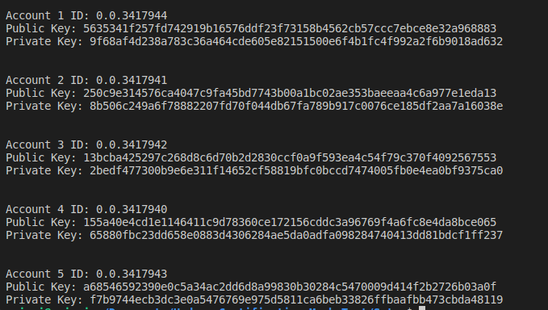

# Task : Setup

## Instructions

1. `npm i` to install dependent packages
2. Add missing values to `sample.env` and change its name to `.env`

3. To run the script `node scripts/accountSetup.js`
4. Sample output
   
